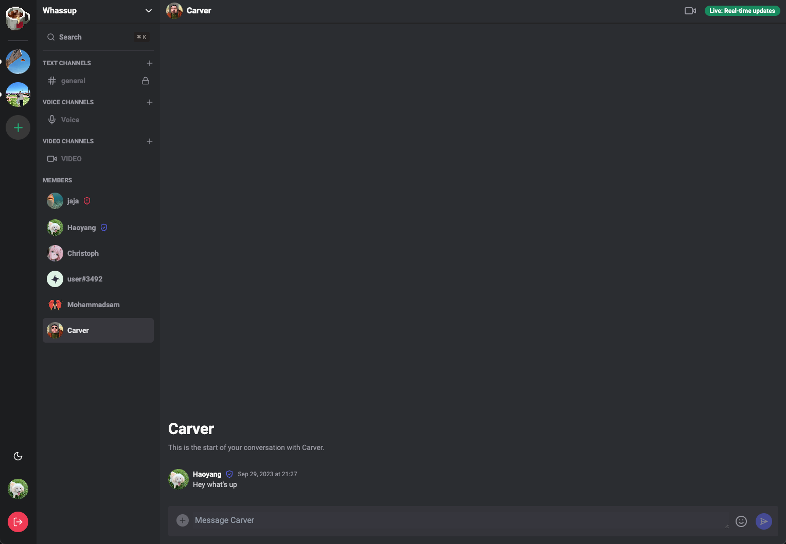

# [oolong.dhguo.dev](https://oolong.dhguo.dev)

# Oolong

Oolong is a dynamic platform designed to foster community engagement through real-time text, voice, and video interactions.


## Table of Contents

- [oolong.dhguo.dev](#oolongdhguodev)
- [Oolong](#oolong)
  - [Table of Contents](#table-of-contents)
  - [Screenshots](#screenshots)
    - [Customize your channel](#customize-your-channel)
    - [Text your friends](#text-your-friends)
    - [Hop on vc](#hop-on-vc)
    - [DM your friend](#dm-your-friend)
  - [Features](#features)
  - [Tech Stack](#tech-stack)
  - [Getting Started](#getting-started)


## Screenshots

### Customize your channel


### Text your friends


### Hop on vc


### DM your friend


  
## Features

- **OAuth 2.0**: Secure authentication via Auth0.
- **Server Management**: Create & customize servers dynamically.
- **Channel Creation**: Text, video, and voice channels supported.
- **Real-time Messaging**: Built on Nest.js Gateway with Socket.io.
- **Video & Voice**: Implemented with LiveKit.
- **DMs**: Text, video calls between server members.
- **Infinite Scroll**: Leveraged react-query for paginated message loading.
- **Role Management**: Assign Kick, Guest, and Moderator roles.
- **Invite System**: Generate unique server invite links.
- **Responsive UI**: Mobile friendly design.
- **Theme Toggle**: Light/Dark mode available.
- **DB & ORM**: Utilized Prisma with PostgreSQL.


## Tech Stack

- **Frontend**: React, react-query, Zustand, Socket.io, LiveKit, Wouter, TailwindCSS, ShadcnUI.
- **Backend**: Node.js, Nest.js, Prisma.
- **Database**: PostgreSQL.
- **Deployment**: Vercel(frontend), DigitalOcean VPS(backend).

## Getting Started

```bash
git clone https://github.com/HaoyangGuo/oolong.git
cd oolong/backend
pnpm install

# Populate a .env file with your credentials, follow .env.example

pnpm run start:dev
```

Then, for the frontend:

```bash
cd ../frontend
pnpm install
pnpm run dev
```